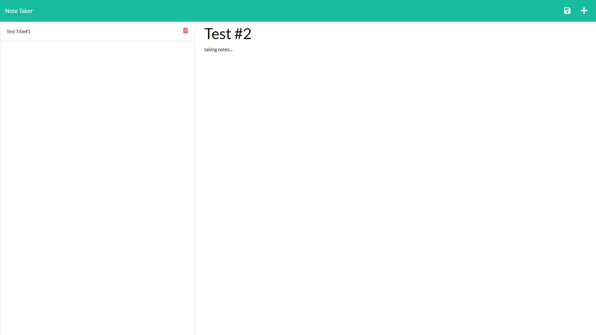

# noteTake

## Table of Contents
- [Description](#Description)
- [Preview](#Preview)
- [Usage](#Usage)
- [License](#License)
- [Contributing](#Contributing)
- [Tests](#Tests)
- [Questions](#Questions)

## Description
This project was the challenge for Express.js and consisted of creating the back end of the project, connecting the provided front end to my created backend, and deploying the app to heroku.

## Preview

## Usage
Vist https://notetake-walidhkhan.herokuapp.com/ to use this app

## License       
UNLICENSED  

## Contributing
walidhkhan, Xandromus, nol166 

## Tests

## Questions
For additional questions or concerns regarding this project, please contact the information below:

**Contact information**  
GitHub: github.com/walidhkhan  
Email: walidhkhan@gmail.com